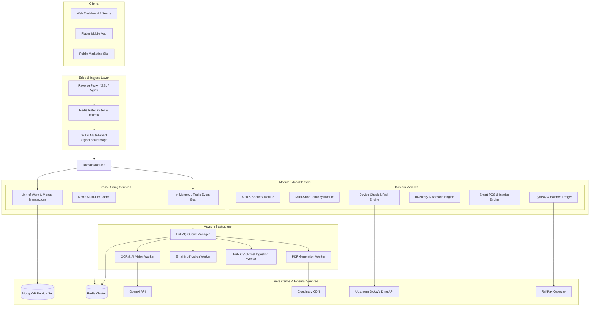
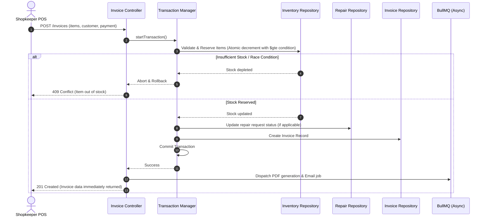
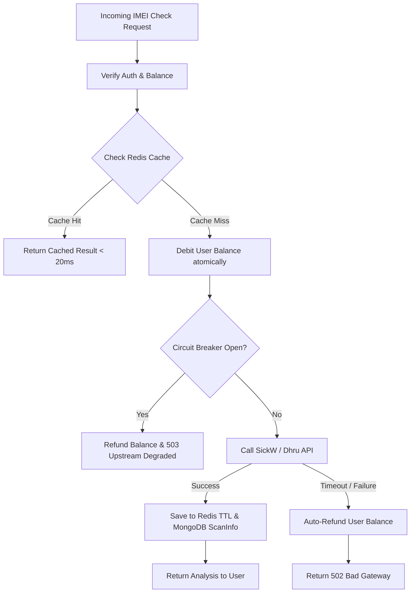
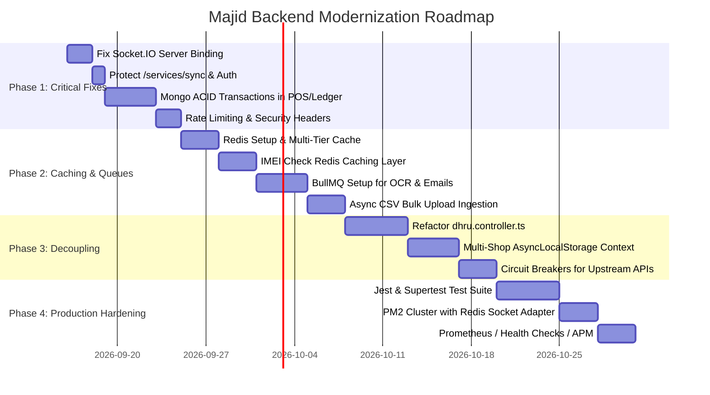

# Majid / ImoScan Backend: System Design & Architectural Blueprint

**Version:** 2.0  
**Target Platform:** Majid / ImoScan (Web Dashboard, Mobile App, E-Commerce / POS System)  
**Document Type:** System Design Document & Implementation Roadmap  
**Author:** DeepMind Antigravity Engineering  
**Date:** March 2025 / September 2026

---

## 1. Executive Summary & Current State Audit

### 1.1 Platform Scope
The Majid platform (running behind `imoscan.com`, mobile Flutter apps, and merchant dashboards) is a specialized SaaS system combining:
1. **Hardware & Device Diagnostics:** IMEI checks, iCloud/Blacklist risk scoring, carrier unlock verification via third-party providers (SickW/Dhru).
2. **Multi-Shop Point of Sale (POS) & Smart Invoicing:** Cart checkout, repair order conversion, multi-payment reconciliation (cash, card, split payments, customer store credit/due).
3. **Serialized & Bulk Inventory Management:** IMEI tracking, variant management, barcode scanning, EAN catalog lookups, bulk CSV imports, and low-stock alerting.
4. **Payment Gateway & Wallet Ledger:** RyftPay integration with platform fee split (connected accounts), merchant wallet balances, and debit/credit ledgering.
5. **Multi-Tenant Architecture:** Multi-shop ownership per shopkeeper, staff isolation, role-based access control (SuperAdmin, Admin, Shopkeeper, Staff, User).
6. **AI & Vision Services:** Tesseract OCR for IMEI & NID scanning, OpenAI GPT parsing for device identification.

---

### 1.2 Critical Architectural Deficiencies & Vulnerabilities in Current Codebase

An in-depth review of the `/majid_9990-backend` codebase revealed several critical architectural and operational issues that prevent the platform from scaling safely:

| Area | Current Implementation Issue | Severity | Impact |
| :--- | :--- | :--- | :--- |
| **Realtime WebSockets** | In `src/config/db.ts`, `http.createServer(app)` is created and attached to `Server(httpServer)`, but `httpServer.listen()` is **never called**! Meanwhile, `src/server.ts` calls `app.listen()`. | **CRITICAL** | Socket.IO is dead in production. Real-time notifications never reach connected clients. |
| **Data Integrity & Concurrency** | Invoicing (`invoice.service.ts`) and wallet balance deductions (`balanceTransaction.service.ts`) perform multiple database operations **without MongoDB ACID sessions / transactions**. | **CRITICAL** | Race conditions, double-spending, inventory overselling, and orphaned records during partial failures. |
| **Security: Exposed Endpoints** | `POST /api/v1/imei/services/sync` in `dhru.routes.ts` has **no authentication middleware**. | **CRITICAL** | Any unauthenticated actor on the public internet can trigger expensive upstream sync operations and overwrite the service catalog. |
| **Monolithic Controller Bloat** | `dhru.controller.ts` is ~1,390 lines (~60 KB), mixing HTTP handling, upstream parsing, currency geo-lookup, DB queries, wallet deductions, and PDF generation. | **HIGH** | Extreme technical debt, untestable logic, high risk of regressions. |
| **CPU-Blocking Operations** | `ocr.service.ts` runs `Tesseract.recognize` on the main Node.js event loop thread. | **HIGH** | Single image upload blocks all incoming HTTP requests for multiple seconds. |
| **Worker Thread Pathing** | `lowStockEmailWorker.ts` references `lowStockEmailWorkerThread.js` directly with `path.join`, failing in TypeScript development environments. Spawns raw threads per job rather than a pooled queue. | **HIGH** | Thread thrashing, memory leaks, unhandled crashes. |
| **Missing Caching Layer** | No Redis instance. Cached IMEI checks query MongoDB with `.find().sort()`. Exchange rates and static catalogs hit upstream APIs repeatedly. | **HIGH** | Unnecessary latency (2-5s per request) and high upstream API costs. |
| **Security & Rate Limiting** | No global or endpoint-specific rate limiting (`express-rate-limit` missing). No security headers (`helmet` missing). Raw CORS errors crash requests. | **HIGH** | Vulnerable to credential stuffing, DoS attacks, and costly API exhaustion. |
| **Multi-Tenancy Overhead** | `ensureDefaultShop` executes multi-table MongoDB queries and updates on **every single request** to resolve shop scoping. | **MEDIUM** | Massive database I/O bottleneck on hot routes. |

---

## 2. Target System Design Architecture

To achieve enterprise-grade stability, horizontal scalability, and sub-100ms response times for cached operations, the backend should transition to a **Clean Modular Monolith** with an **Asynchronous Task Queue** and a **Redis Distributed Caching Layer**.



---

## 3. Core Architectural Subsystems

### 3.1 Layered Clean Architecture Breakdown

The codebase will be restructured into strict, predictable architectural boundaries:

```
src/
├── app.ts                  # Express application setup, middlewares, global error handlers
├── server.ts               # HTTP & Socket.IO server bootstrap & graceful shutdown
├── config/                 # Typed environment configurations, DB and Redis clients
├── shared/                 # Cross-cutting primitives
│   ├── errors/             # Standardized domain & HTTP error classes
│   ├── middlewares/        # Rate limiter, Tenant context, Authentication, Validation
│   ├── transactions/       # MongoDB atomic transaction wrapper (Unit-of-Work)
│   ├── cache/              # Redis caching client & key management
│   ├── queue/              # BullMQ queue producer and connection instances
│   └── utils/              # Cryptography, math, money formatting, Luhn validator
├── modules/                # Self-contained business domains
│   ├── auth/
│   ├── shop/               # Tenant isolation, shop assignment, multi-shop billing
│   ├── deviceCheck/        # IMEI checks, risk analysis, bundle checks, upstream adapters
│   ├── inventory/          # Serialized & non-serialized stock, variants, barcode
│   ├── invoice/            # POS checkout, split payment, customer ledger
│   ├── payment/            # RyftPay connect, webhook idempotency, balance ledger
│   ├── ocr/                # Vision API, async job dispatch
│   └── notification/       # Socket.IO emitter, template rendering
└── workers/                # BullMQ background worker consumers
    ├── ocr.worker.ts
    ├── email.worker.ts
    ├── bulkImport.worker.ts
    └── pdf.worker.ts
```

Each module contains:
- `*.model.ts`: Mongoose schema and database models with indexes.
- `*.interface.ts`: Typed domain entities and DTOs.
- `*.repository.ts`: Pure database access layer (decoupled from HTTP).
- `*.service.ts`: Pure business rules, validations, and transactional mutations.
- `*.controller.ts`: Pure HTTP handler (request extraction, calling service, sending response).
- `*.routes.ts`: Express router with schema validation middlewares (`zod`).

---

### 3.2 Concurrency & Transactional Integrity (ACID POS & Ledger)

#### The Problem:
Currently, when a POS invoice is created:
1. Cloudinary upload runs.
2. An invoice record is saved.
3. Multiple loops iterate over inventory to subtract quantity.
4. If item quantity reaches zero or negative, no rollback occurs.
5. Customer due balances and repair requests are updated outside of a transaction.

#### The Solution: MongoDB Multi-Document Transactions with Pessimistic Locking
Implement an execution wrapper `withTransaction` using MongoDB Replica Set sessions.



**Key Improvements:**
- Zero overselling: Inventory decrements use conditional query filters:  
  `{ _id: itemId, quantity: { $gte: requiredQuantity } }`. If `matchedCount === 0`, the transaction automatically rolls back.
- Idempotency Keys: A unique header `X-Idempotency-Key` prevents double-submitting invoices during network lag.
- Asynchronous PDF Upload: The customer does not wait 3-5 seconds for Cloudinary upload before getting an invoice confirmation. The PDF is rendered in the background and streamed via WebSockets or download link.

---

### 3.3 Multi-Tenant Isolation & Optimized Request Context

#### The Problem:
`ensureDefaultShop` executes up to 6 database queries on every HTTP request to resolve default shops, creating high database overhead.

#### The Solution: `AsyncLocalStorage` & Tenant Middleware
1. **Tenant Context Middleware**:
   - Extract `token` and identify `userId`, `role`, and `shopkeeperId`.
   - Read `X-Shop-Id` from request headers (or query parameter).
   - Verify that the target `shopId` belongs to the authenticated `shopkeeperId` using **Redis cache** (`cache:user_shops:<userId>`).
   - Store active `tenantContext` in Node.js `AsyncLocalStorage`.
2. **Repository Scoping**:
   - Mongoose queries automatically inherit `{ shopId: context.activeShopId }` without repetitive controller logic.

```typescript
export interface TenantContext {
  userId: string;
  role: 'superAdmin' | 'admin' | 'shopkeeper' | 'staff' | 'user';
  shopkeeperId: string;
  activeShopId: string;
}
```

---

### 3.4 Device Check & IMEI Engine Architecture

#### Current Bottleneck:
- `dhru.controller.ts` mixes upstream API communication, rate calculation, currency conversion, MongoDB querying, and balance debiting.
- If upstream (SickW) takes 15 seconds to reply, the thread connection remains pinned, and if it fails, manual refund logic is messy.

#### Architecture Refactoring:
1. **Upstream Provider Adapter Pattern:**
   - Define a unified `IImeiProviderAdapter` interface.
   - Implement `SickwAdapter` and `DhruAdapter` with timeout (10s) and retry policies.
2. **Circuit Breaker (Opossum):**
   - If upstream returns 5 consecutive timeouts or 500 errors, the circuit opens for 30 seconds, immediately returning a graceful message to the user rather than hanging connections.
3. **Redis Caching Strategy:**
   - Key: `imei:check:<serviceId>:<imeiNumber>`
   - TTL: 7 days for immutable hardware info (model, carrier, memory); 12 hours for dynamic status (FMI status, blacklist).
   - If cached, serve directly in `<15ms` without debiting full upstream cost (or debit nominal platform fee).



---

### 3.5 Asynchronous Task Queue (BullMQ + Redis)

Replace fragile in-process worker threads and synchronous heavy computation with a unified BullMQ task pipeline.

| Queue Name | Job Type | Concurrency | Retry Policy | SLA |
| :--- | :--- | :--- | :--- | :--- |
| `queue:ocr` | Tesseract Image OCR + OpenAI Extraction | 2 workers | 2 retries | < 5s |
| `queue:bulk-import` | Large CSV / Excel (10,000+ rows) | 1 worker | 1 retry | Background |
| `queue:email` | Low Stock Alerts, Invoices, Reset Password | 5 workers | 5 exponential retries | < 3s |
| `queue:pdf` | Invoice PDF & IMEI Diagnostics Report | 3 workers | 2 retries | < 4s |
| `queue:webhook` | RyftPay Webhook Processing | 5 workers | 5 exponential retries | Immediate |

**Advantages:**
- **Zero Event Loop Starvation:** Heavy OCR and PDF generation run in dedicated background worker processes.
- **Fault-Tolerance:** Failed jobs are saved in a Dead Letter Queue (DLQ) for inspection and replay.
- **Monitoring:** Real-time visibility into active, waiting, and failed jobs via Bull-Board UI.

---

### 3.6 Realtime Subsystem (Socket.IO Fix & Cluster Architecture)

#### Immediate Fix for `server.ts` & `db.ts`:
Unify the HTTP server instance:
```typescript
// server.ts
import http from 'http';
import app from './app';
import { initSocketServer } from './modules/socket/socket.server';

const server = http.createServer(app);
const io = initSocketServer(server);

server.listen(PORT, () => {
  console.log(`Server listening on port ${PORT}`);
});
```

#### Multi-Instance Scaling (Redis Adapter):
When PM2 runs in cluster mode (`instances: "max"`), clients connected to Node Instance 1 cannot receive events emitted from Node Instance 2.
- Integrate `@socket.io/redis-adapter` so events emitted on any backend node are automatically routed across all connected instances via Redis Pub/Sub.

---

### 3.7 API Security & Hardening Blueprint

1. **Rate Limiting:**
   - Global API limiter: 300 requests per 15 minutes per IP.
   - Sensitive endpoints:
     - `POST /api/v1/auth/login`: 5 attempts per 15 minutes.
     - `POST /api/v1/imei/check`: 30 checks per minute per user.
     - `POST /api/v1/ocr/*`: 10 requests per minute per user.
2. **Security Headers (`helmet`):**
   - Content Security Policy (CSP), HSTS, noSniff, frameguard to prevent clickjacking.
3. **Endpoint Protection:**
   - Secure `POST /api/v1/imei/services/sync` with `protect` + `isAdmin` middleware.
4. **Input Sanitization & Validation:**
   - Enforce strict `Zod` schema validation on all incoming request bodies and query parameters. Replace loose regex with verified Luhn IMEI validation algorithms.

---

## 4. Database Schema & Indexing Optimization Plan

### 4.1 Index Overhaul

| Collection | New / Modified Index | Purpose | Index Type |
| :--- | :--- | :--- | :--- |
| `inventories` | `{ storeId: 1, imeiNumber: 1 }` | Fast barcode/IMEI lookup scoped to a shop | Unique Compound (Sparse) |
| `inventories` | `{ storeId: 1, status: 1, quantity: 1 }` | Fast low-stock & active inventory queries | Compound |
| `invoices` | `{ shopId: 1, createdAt: -1 }` | Instant invoice list loading in shopkeeper dashboard | Compound |
| `invoices` | `{ shopkeeperId: 1, customerInfo: 1 }` | Fast customer order history & due calculation | Compound |
| `scaninfos` | `{ userId: 1, shopId: 1, createdAt: -1 }` | History pagination without in-memory sorting | Compound |
| `balancetransactions` | `{ userId: 1, createdAt: -1 }` | Wallet statement retrieval | Compound |

> **Note on `inventories.imeiNumber`:**  
> Currently `imeiNumber` has a global `unique: true`. Non-phone inventory items (cables, screen protectors) or identical IMEIs across separate independent shops will fail. The unique constraint must be scoped as `{ storeId: 1, imeiNumber: 1 }` and made `sparse: true`.

---

## 5. Phased Implementation Plan & Execution Roadmap



### Phase 1: Critical Stability & Security Fixes (Sprint 1)
- [ ] **Fix Socket.IO bootstrap:** Modify `server.ts` to create the HTTP server, bind Socket.IO, and listen on the single server instance. Remove rogue server instantiation from `db.ts`.
- [ ] **Secure Admin endpoints:** Add `protect` and `isAdmin` to `POST /api/v1/imei/services/sync`.
- [ ] **Implement Multi-Document Transactions:** Wrap invoice creation, inventory deduction, and customer balance updates in `session.withTransaction()`.
- [ ] **Global Security Layer:** Add `helmet`, `cors` preflight fix, and `express-rate-limit`.

### Phase 2: High-Performance Caching & Job Queues (Sprint 2)
- [ ] **Deploy Redis:** Configure Redis client for distributed key-value storage.
- [ ] **IMEI Cache Implementation:** Cache SickW/Dhru responses with TTL (7 days for hardware specs, 12h for blacklist).
- [ ] **BullMQ Integration:** Offload `Tesseract.recognize` OCR, Low-stock emails, and Invoice PDF generation into BullMQ workers.
- [ ] **Bulk CSV Ingestion:** Move `/create-from-barcode/bulk` to asynchronous job processing with streaming progress via Socket.IO.

### Phase 3: Domain Decoupling & Clean Architecture (Sprint 3)
- [ ] **Deconstruct `dhru.controller.ts`:** Separate into `ImeiCheckService`, `CatalogSyncService`, `RiskScoringService`, and `DhruAdapter`.
- [ ] **Optimize Multi-Shop Resolution:** Replace per-request DB queries in `ensureDefaultShop` with cached shopkeeper entitlements in Redis.
- [ ] **Upstream Circuit Breaker:** Implement Opossum circuit breaker for SickW and RyftPay APIs to handle upstream degradation gracefully.

### Phase 4: Production Reliability, Testing & Observability (Sprint 4)
- [ ] **Automated Test Harness:** Setup Jest + Supertest for Auth, Invoicing, Inventory, and IMEI Check flows.
- [ ] **PM2 Cluster & Socket Redis Adapter:** Run backend in cluster mode across multiple CPU cores.
- [ ] **Observability & Logging:** Implement Pino structured JSON logging with correlation IDs (`X-Request-Id`) and Prometheus health metrics (`/health`, `/metrics`).

---

## 6. Verification & Quality Acceptance Criteria

1. **Real-time Notifications:** Connect dashboard client to Socket.IO; trigger a repair request update or low-stock event; client receives event immediately.
2. **Concurrent POS Checkout:** Simulate 10 simultaneous checkouts of an item with only 1 in stock; verify exactly 1 succeeds and 9 fail with 409 Conflict without negative inventory.
3. **IMEI Check Latency:** Second lookup of an identical IMEI returns within `< 25ms` directly from Redis cache without hitting SickW.
4. **Event Loop Non-Blocking:** Upload a 5MB image for OCR; verify concurrent API requests to `/api/v1/user/profile` complete with `< 50ms` latency.
5. **Security Scan:** Unauthenticated request to `/api/v1/imei/services/sync` returns `401 Unauthorized`.
